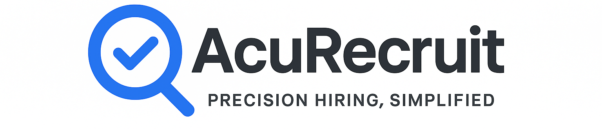

<p align="center">
  
</p>


# AcuRecruit (Interview Agent)

**AcuRecruit** is an advanced AI-driven application that conducts structured, contextual job interviews based on a candidate’s resume and the target job role. It simulates a realistic interviewer, evaluates responses, and exports a polished HR-grade evaluation report in PDF format.

---
## 🎯 Demo
**Try it live :** [AcuRecruit](https://acurecruit.streamlit.app)


## ⭐ Overview

This application uses **Google Gemini 2.5 Flash** to:

* Analyze a candidate’s uploaded resume (PDF)
* Extract skills, experience summaries, and key projects
* Conduct a dynamic, 10-question AI-powered interview
* Adjust interviewer tone (e.g., Strict, Friendly)
* Generate a thorough evaluation containing:

  * Technical, Communication & Cultural Fit scores
  * Detailed narrative analysis
  * Automatically detected strengths & weaknesses
  * A clean, professional PDF evaluation report

---

## 📌 Features

### ✅ Automated Resume Parsing & Context Injection

* Extracts hard skills, key projects, and a brief experience summary.
* Uses extracted data as context for AI interview questions.

### ✅ Real-Time Interview Flow

* Asks **10 contextual questions** one at a time.
* Supports different interviewer personalities (Strict, Friendly, Default).
* Maintains coherent, structured interview conversation.

### ✅ Automated Evaluation Report

* Generates numerical scores for competencies.
* Produces a structured 3-section narrative assessment.
* Provides JSON-formatted strengths and weaknesses.
* Displays formatted HTML in Streamlit and generates a professional PDF report.

### ✅ User-Friendly Interface (Streamlit)

* Clear steps: Configuration → Interview → Final Report.
* Autosaves chat history.
* Sidebar shows candidate summary.

---

## ⚠️ Limitations

* LLM-based assessments are **not legal hiring decisions**.
* Resume extraction depends on PDF formatting; image-based PDFs may fail.
* Google Gemini API key required.
* Model output formatting may occasionally drift; regex extraction mitigates some issues.
* Not suitable for compliance-heavy hiring assessments.

---

## 🧰 Tech Stack

* **Frontend / App Framework:** Streamlit 1.x
* **AI / NLP:** Google Gemini 2.5 Flash API, google/genai Python SDK
* **Data Processing:** Python 3.10+, Pydantic, Pandas
* **Document Generation:** ReportLab
* **Other Libraries:** dotenv, re, io, datetime

---

## ⚙️ Setup & Installation

### 1. Clone Repository

```bash
git clone https://github.com/Abhinav-Muralidhar/AcuRecruit.git
cd AcuRecruit
```

### 2.Create Virtual Environment and Install Dependencies

```bash
python -m venv venv
source venv/bin/activate  # Linux/Mac
venv\Scripts\activate   # Windows
pip install -r requirements.txt
```

### 3. Configure Environment Variables

Create a `.env` file:

```
GEMINI_API_KEY=your_google_api_key_here
```

### 4. Run the Application

```bash
streamlit run app.py
```

Visit `http://localhost:8501` in your browser.

---

## 📄 How to Use

### Step 1 — Upload Resume & Select Role

* Upload a PDF resume.
* Select a job position or paste a job description.
* Pick interviewer personality.
* Click **Analyze Resume**.

### Step 2 — Run Interview

* Click **Start Interview**.
* Answer each AI-generated question.
* After 10 questions, click **Generate Final Report**.

### Step 3 — Download Evaluation

* View interactive scores and insights.
* Download the official PDF report.

---

## 🚀 Potential Improvements

### AI Enhancements

* Voice-based interviews.
* Coding challenge modules for technical roles.
* Improved structured parsing using Vision-LLMs.

### Scoring Enhancements

* Rubric-based scoring.
* Consistency checks on candidate answers.
* Weighted scoring per role.

### Report Improvements

* Include charts/graphs in PDFs.
* Multi-page formatting options.
* Comparative benchmarking (percentiles).

### Platform Improvements

* Login/user accounts.
* Admin dashboard for multiple candidates.
* Database persistence (PostgreSQL, Firebase).


### Architecture Diagram
<p>
  
</p>


---

## 📝 License

This project is for academic and portfolio purposes only. Use it as a reference or learning tool.